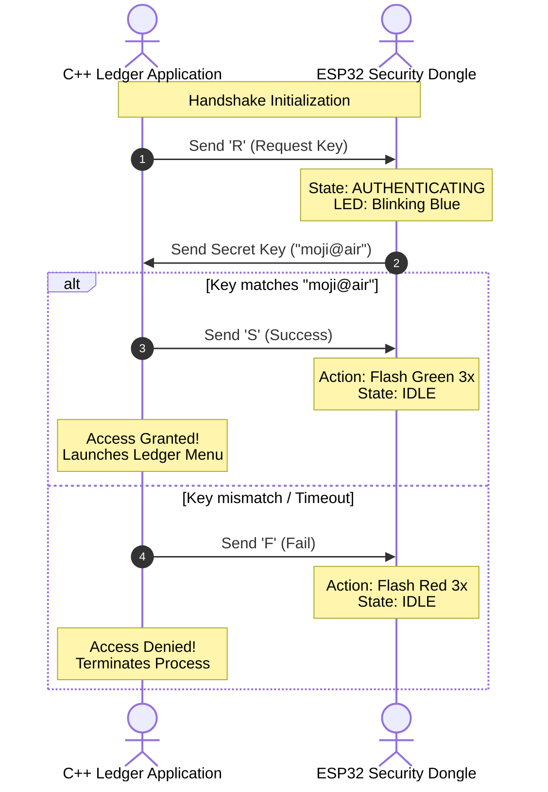

```markdown
# Electricity Bill Ledger with Hardware Security Dongle

An absolute, secure console-based database ledger application written in C++ that manages electricity consumer data using a flat CSV file database. Access to the ledger is protected by a physical hardware token (an ESP32/microcontroller) using an automated challenge-response authentication mechanism over a serial (COM) port connection.

---

## 🛠️ System Architecture



---

## 🚀 Features

* **Hardware Token Authentication:** Full serial integration with an ESP or Arduino microcontroller running FastLED logic to act as a physical security lock.
* **Non-Blocking Visual Status:** The hardware dongle displays real-time system states via a WS2812 RGB LED (Blinking Blue = Authenticating, Green = Success, Red = Denied).
* **Robust CSV Database:** Implements parsing, unique data constraints validation, full text search via strings, record updating, and soft entry deletion.
* **Fail-Safe Timeouts:** Configured Windows API serial communications with dynamic timeout constants to prevent system freezing if a hardware device drops unexpectedly.

---

## 📂 Repository Structure

* `ESP/Esp side/` — Contains microcontroller configuration builds.
* `esp_side.cpp` — The firmware core driving the serial listening state-machine and FastLED RGB notifications.
* `main.cpp` — Main Windows C++ Ledger Console implementation including Win32 File/Serial configurations.
* `Electricity bill ledger.csv` — The dynamic database store holding structured consumer parameters (`consumer_id,name,unit`).
* `main.exe` — Precompiled production executable.

---

## 🔧 Prerequisites & Setup

### 1. Hardware Requirements

* Any microcontroller compatible with the Arduino framework (e.g., ESP32, ESP8266, Arduino Nano).
* An addressable WS2812 RGB LED mapped to **Pin 48** (change `#define LED_PIN` in firmware if using a different board).

### 2. Microcontroller Flash

1. Open `esp_side.cpp` in your preferred IDE (VS Code with PlatformIO or Arduino IDE).
2. Install the **FastLED** dependency library.
3. Compile and upload the binary to your micro-device.

### 3. PC Application Configuration

Before running or building the C++ console app, make sure your target COM port matches your connected hardware. Open `main.cpp` and locate the `authenticateHardwareKey()` block:

```cpp
// Change "\\\\.\\COM5" to match your machine's Device Manager assignment (e.g., COM3, COM9)
HANDLE hSerial = CreateFileA("\\\\.\\COM5", GENERIC_READ | GENERIC_WRITE, 0, NULL, OPEN_EXISTING, FILE_ATTRIBUTE_NORMAL, NULL);

```

---

## 💻 How to Run the Project

### Using Precompiled Binary (Windows Only):

1. Plug your flashed hardware dongle into a USB slot.
2. Ensure your port variables match **COM5** (or adjust using standard terminal mapping).
3. Open a command prompt inside the root directory and run:
```bash
main.exe

```


### Compilation From Source (GCC/MinGW):

```bash
g++ main.cpp -o main.exe
main.exe

```

---

## 🔒 Security Authentication Protocol Detail

When the software boots or sequences into a secure checkpoint loop:

1. **Handshake Initialization:** The PC sends a single character `'R'` to request the validation sequence.
2. **Key Challenge:** The ESP controller detects `'R'`, flips its processing state to `AUTHENTICATING`, and broadcasts the embedded security token phrase back to the application array.
3. **Validation & Visual Feedback:**
* If the key matches `moji@air`, the PC replies with an `'S'` signal; the dongle flashes **Green** 3 times, and database write/read operations are unlocked.
* If invalid or timed out, the PC emits an `'F'` signal; the dongle flashes **Red** 3 times, and execution instantly terminates via an access-denied exception sequence.


```

```
